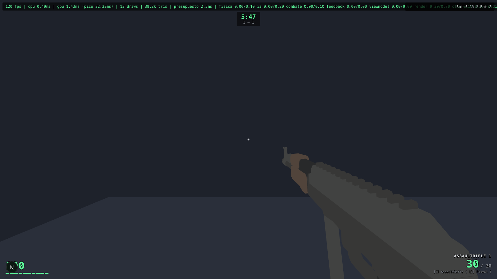

# iagame

FPS arcade en el navegador, construido sobre Three.js + Next.js. Sin servidor de partida: todo corre client-side, con un conversor de sensibilidad que mantiene los cm/360 al moverte entre este juego y CS, Valorant, Apex, Overwatch, CoD o Quake.



## Qué hay adentro

- **40 armas** con recoil y balística por arma — dos SMGs no se sienten iguales. Pipeline propio `FBX → GLB` con guardia que impide commitear assets no CC0 (ver `scripts/workshop-guard.test.ts`).
- **Bots con FSM**: percepción (raycasts + memoria de posición), pathfinding sobre navmesh, búsqueda de cobertura, selección de arma por distancia. Dificultad continua de 0 a 1.
- **Conversor de sensibilidad** (`/armory`): traducís tu sensibilidad de CS/Valorant/Apex/OW/CoD/Quake + DPI y te da la de este juego manteniendo los cm/360. Se guarda en `localStorage`.
- **Sistema de camos** por vía de textura con patrones procedurales y desbloqueo por progresión.
- **Medallas** con galería `/medals` que lee el guardado real y acredita XP.
- **Modos**: TDM / FFA, con límites de tiempo y score, y un modo `?practica=1` con dianas de plinkeo sin bots.

## Stack

- **Three.js** (renderer, BVH con `three-mesh-bvh` para raycast)
- **Next.js 16** (App Router, React 19)
- **TypeScript strict**, **Tailwind 4**
- **Vitest** cubriendo bot AI, coherencia de física, hitboxes y nav grids

## Correr

```bash
pnpm install
pnpm dev          # http://localhost:3000
pnpm test         # vitest run
pnpm lint         # eslint
```

El skybox se regenera en `predev` desde `scripts/generate-skybox.ts` — no se commitea.

## Parámetros de URL (`/play`)

| Parámetro | Qué hace |
|---|---|
| `?practica=1` | Modo práctica: dianas de plinkeo en el corredor, 0 bots por defecto |
| `?bots=N` | 0 a 20 bots |
| `?mode=tdm\|ffa` | Modo de partida |
| `?map=NOMBRE` | Mapa (gana sobre el panel de tuning) |
| `?difficulty=0..1` | Dificultad de todos los bots |
| `?timeLimit=S` / `?scoreLimit=N` | Overrides de duración |
| `?debug=1` | Panel de tuning de armas + `window.__combatDebug()` |

## Política de assets

El repo sólo commitea assets CC0 (`public/assets/weapons/`, `public/assets/audio/`).
Los derivados del Steam Workshop viven en carpetas gitignored (`workshop-assets/`,
`public/assets/weapons-local/`, `public/assets/maps/`, `public/assets/audio/weapons-local/`)
y el catálogo del juego los intenta en runtime: si no están, cae a los CC0 sin
romper. La guardia real es un test (`scripts/workshop-guard.test.ts`) que inspecciona
el índice de git, no el `.gitignore` — un `git add -f` mal intencionado falla el CI.

## Licencia

MIT. Ver [LICENSE](LICENSE).
